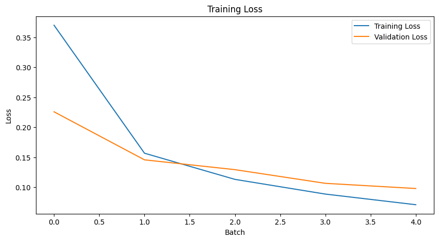

# Recognizing digits (MNIST) using a simple neural network with PyTorch

## Section 1: Data Loading and Exploration
- First, we load the MNIST dataset using the `torchvision` library.
- Next, we explore the dataset by looking at its size and visualizing some of the images.
- Finally, we prepare the dataset for training by normalizing the pixel values.

## Section 2: Model Design and Training
- We design a simple neural network model using the `torch.nn` module.
- The net has 3 fully connected layers with ReLU activation functions (784 -> 512 -> 128 -> 10), and a softmax layer at the end to convert the outputs into probabilities.
- We use the negative log-likelihood loss function and the stochastic gradient descent optimizer for training the model.
- We train for 5 epochs and evaluate the model on the validation set after each epoch. We also implement early stopping to prevent overfitting.

## Section 3: Model Testing and Evaluation
- Finally, we evaluate the model on the test set and calculate the accuracy achieved (97.23%).
- We also visualize some of the predictions made by the model on the test set, including both correct and incorrect predictions.
- Finally, we save the model for future use.

### This notebook provides a simple example of how to build and train a neural network model for image classification using PyTorch.